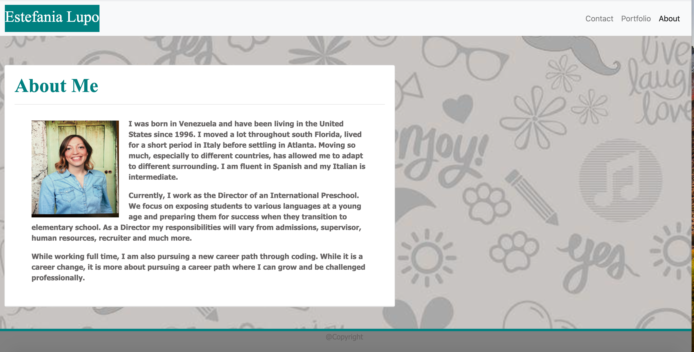

#About-Me

About-Me

The purpose of this assignment was to use, as my instructor says, our “toolbox” of all the topics covered so far to recreate three HTML pages that they provided. We had to ensure that these pages designs were responsive and that they looked well if viewed in a mobile. What really helped me through this assignment was using bootstrap and using its grid system, which was one of the main points of this assignment. Using bootstrap saved me time from creating a website from scratch and for most, but not all, of my HTML pages could adjust to phone, tablets and desktop.

#Installation

•	Created a git repository
•	Created three files on VS code as well as the CSS and Readme’s.
•	Used bootstrap for:
o	Navbar
o	Cards
o	Forms
o	Jumbotron
o	Grid
o	Footer

#Pages

Using bootstrap gave me the confidence that I could actually create a website. It was a very useful tool. My biggest struggle was adding the images to the portfolio. I solved this by using the grid from bootstrap, inspecting the page and lots of trial and error. My other struggle was getting the text in the about me to wrap to my picture. While bootstrap gives you the code you need to personalize it tweak it to get the results that you need, which was the most important lesson learned. 

#License

Used MIT License for this assignment. 
